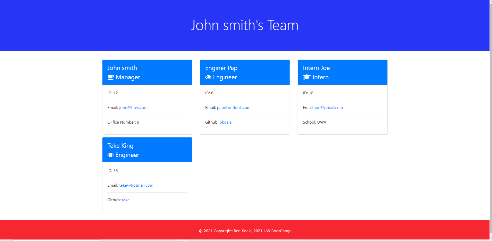

# TeamProfile_Generator

The profile generator application uses npm inquirer to generate a webpage that displays a team's basic information that includes their emails and GitHub profiles links.

# Use of the application

##
The application gives the user a  command-line application that accepts user input
answering questions about the team members and their information
An HTML file is generated that displays a nicely formatted team roster based on the answers to the questions.
##
When the user clicks on an email address in the generated HTML a default email program opens and populates the "To" of the email with the address of the team member.
When a user clicks on the GitHub username he is taken to the  GitHub profile of the team member opened in a new tab.
##
At the start of the application the user is prompted to enter the team manager’s name, employee ID, email address, and office number.  Afther entering all requested information a menu is displayed where the user has the option to add an engineer or an intern or to exit the application
##
When the user select the engineer option, then he is prompted to enter the engineer’s name, ID, email, and GitHub username, and he is taken back to the menu where he could then choose an option from the menu. The intern option allows the user to enter
the intern’s name, ID, email, and school to be added to the team. 
##
When the user decides to finish building his team he could exit the application with the exit option and an "index.html" file is generated and put under the "dist" folder.  Below a screen shot of a generated file is shown. 
##
 All user's inputs are validated prior to being accepted by the application.

# Links

Github Link Repo Link :https://github.com/bkoala/Bk_TeamProfile_Generator

Demo Video link : https://drive.google.com/file/d/18baVOZx6pF9uUAcxVnoRRtzXi_EYEc-U/view

Application Screen Shot :